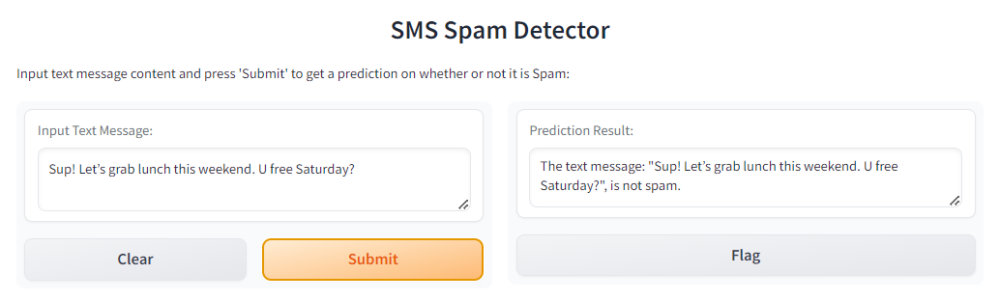
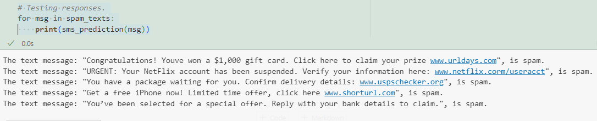

# **SMS Spam Detection with TF-IDF and Support Vector Machine (SVM)**

This project uses a machine learning pipeline with **TF-IDF Vectorization** and a **Support Vector Machine (SVM)** classifier to differentiate between spam and non-spam (ham) messages.

The project demonstrates how to preprocess SMS data, build an SMS classification model, and deploy a Gradio interface for real-time SMS spam detection.

**[Core Technologies, Tools](#core-technologies-tools)** | **[Project Workflow](#project-workflow)** | **[Interpretation and Insights](#interpretation-and-insights)** | **[Follow-On Improvements](#follow-on-improvements)**

---

## Abstract

Created a machine learning pipeline to classify SMS messages as spam or not spam.

* **TF-IDF (Term Frequency-Inverse Document Frequency) Vectorizer** to convert text messages into numerical vectors that represent the importance of words in each message.
* **LinearSVC (Linear Support Vector Classifier)** from `sklearn` used as the classification model for prediction; model is trained on the vectorized (labeled) SMS messages.
* **Gradio** used to build a simple web interface that allows users to input text messages and receive real-time spam classification results.

<figure>
    <figcaption><em>Spam.</em></figcaption>
    
</figure

<figure>
    <figcaption><em>Not Spam.</em></figcaption>
    
</figure>

<figure>
    <figcaption><em>Gradio.</em></figcaption>
    
</figure

---

## Core Technologies, Tools

* **Languages/Tools** : Python, Jupyter Notebook, VS Code, Google Colab
* **Libraries** : scikit-learn, pandas, NumPy, Gradio
* **Feature Engineering, EDA** : TF-IDF Vectorization, Cross-Validation, Data Scaling
* **Model Algorithms, Architecture** : Linear Support Vector Classifier (Linear SVC), Scikit-learn Pipeline for Text Classification

---

## Project Workflow

#### **Data Collection**

Dataset used in this project is the `SMSSpamCollection.csv`, which contains SMS messages labeled as either "spam" or "ham" (not spam). This dataset is used to train the classifier.

<figure>
    <figcaption><em>Sample Entries from Text Dataset</em></figcaption>
    
</figure>

#### **SMS Classification**

Function  `sms_classification` returns **fitted `Pipeline` model** (`text_clf`) that includes the TF-IDF Vectorization conversions and Linear Support Vector classification model.

* **TF-IDF Vectorization** : converts the text data into numerical features using Term Frequency-Inverse Document Frequency (TF-IDF), which helps in transforming the text into a format that the machine learning model can understand
  * `stop_words='english'` parameter removes common English words that are unlikely to be useful for classification.
* **Linear Support Vector Classification (SVC)** : Support Vector Machine (SVM) classification model with a linear kernel is trained on transformed training data and is used to classify the text messages

<figure>
    <figcaption><em>Pipeline</em></figcaption>
    
</figure>

#### SMS Prediction

Function `sms_prediction` takes the text iterable (input SMS message) and makes predictions; labels ('spam' or 'not spam') are used as the target variable.

    `prediction = text_clf.predict([text])`

---

## Interpretation and Insights

The model performed well in identifying spam based on the SMS content, especially on short, promotional texts commonly found in spam.

Below are samples of Spam and Non-Spam detections, that include emojis and slang, all correctly identified:

<figure>
    <figcaption><em>Spam Detections:</em></figcaption>
    
</figure>

<figure>
    <figcaption><em>Non-Spam, Gen-Z-ish</em></figcaption>
    
</figure>

---

## Follow-On Improvements

* Add more additional pre-processing to handle special characters and emojis.
* Possible exploration of other algorithms like Naive Bayes or Random Forest for text classification.
* Expand the model to handle more complex spam detection tasks, such as detecting phishing attempts.
* Apply hyperparameter tuning to optimize the performance of the classifier.
* Explore additional deep learning methods for text classification.
